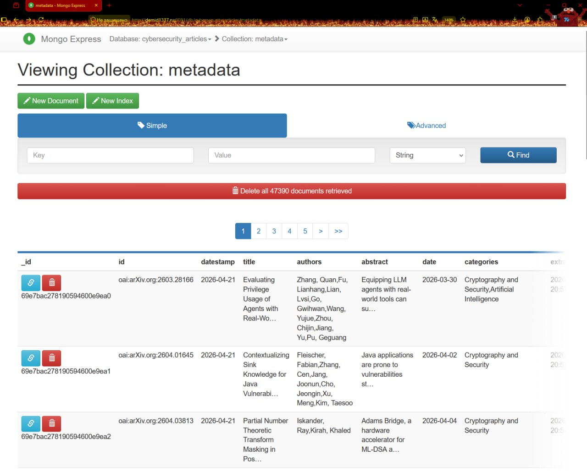

# Extract&Transform stage

## {auto-animate=true auto-animate-easing="ease-in-out"}

::: {data-id="box1" style="background: #000000; width: 0px; height: 1px; border-radius: 200px;"}
:::

::: {.absolute top=100 left=0 width="10000" height="300"}
На данной стадии мы получим необходимые данные с сайта arxiv.org.

Для парсинга мы воспользуемся следующими библиотеками:

:::
## {auto-animate=true auto-animate-easing="ease-in-out"}
::: {.absolute top=100 left=0 width="10000" height="300"}
На данной стадии мы получим необходимые данные с сайта arxiv.org.

Для парсинга мы воспользуемся следующими библиотеками:

- **httr** - для запросов к API
:::
## {auto-animate=true auto-animate-easing="ease-in-out"}
::: {.absolute top=100 left=0 width="10000" height="300"}
На данной стадии мы получим необходимые данные с сайта arxiv.org.

Для парсинга мы воспользуемся следующими библиотеками:

- **httr** - для запросов к API
- **xml2** - для парсинга результатов
:::
## {auto-animate=true auto-animate-easing="ease-in-out"}
::: {.absolute top=100 left=0 width="10000" height="300"}
На данной стадии мы получим необходимые данные с сайта arxiv.org.

Для парсинга мы воспользуемся следующими библиотеками:

- **httr** - для запросов к API
- **xml2** - для парсинга результатов
- **dplyr** - для обработки данных
:::
## {auto-animate=true auto-animate-easing="ease-in-out"}
::: {.absolute top=100 left=0 width="10000" height="300"}
На данной стадии мы получим необходимые данные с сайта arxiv.org.

Для парсинга мы воспользуемся следующими библиотеками:

- **httr** - для запросов к API
- **xml2** - для парсинга результатов
- **dplyr** - для обработки данных
-  **jsonlite** - для "упаковки" результатов в JSON
:::

## {auto-animate=true auto-animate-easing="ease-in-out"}

::: {data-id="box1" style="background: #000000; width: 10000px; height: 10000px; border-radius: 200px; margin: -5000px 0 0 -5000px;"}
:::

::: {.absolute top=100 left=0 width="10000" height="500"}
**<span style="color: white">Основные Функции</span>**
:::

## {auto-animate=true, background-color="black"}

::: {.r-hstack}
::: {.absolute top=100 left=-150 width="10000" height="300"}
Функция **parse_oai_records** парсит полученные записи. 

Она принимает XML, полученный от *arxiv*, 

и для каждой записи вытаскивает

 необходимую информацию:

- **авторы**
- **дата**
- **заголовок**
- **id**
- и другие
:::
:::
::: {.r-hstack}
::: {.absolute top=20 left=900 width="850" height="300"}
```{.r}
parse_oai_records <- function(xml_content) {
  ns <- c(oai = "http://www.openarchives.org/OAI/2.0/",
          dc  = "http://purl.org/dc/elements/1.1/")
  
  records <- xml_find_all(xml_content, ".//oai:record", ns)
  
  lapply(records, function(rec) {
    get_field <- function(xpath) {
      node <- xml_find_first(rec, xpath, ns)
      if (is.na(node)) NA_character_ else xml_text(node)
    }
    get_all <- function(xpath) {
      nodes <- xml_find_all(rec, xpath, ns)
      if (length(nodes) == 0) NA_character_ 
      else paste(xml_text(nodes), collapse = " | ")
    }
    
    list(
      id          = get_field(".//oai:identifier"),
      datestamp   = get_field(".//oai:datestamp"),
      title       = get_field(".//dc:title"),
      authors     = get_all(".//dc:creator"),
      abstract    = get_field(".//dc:description"),
      date        = get_field(".//dc:date"),
      categories  = get_all(".//dc:subject")
    )
  })
}
```
:::
:::

## {auto-animate=true, background-color="black"}

::: {.r-hstack}
::: {.absolute top=100 left=-170 width="10000" height="300"}
Функция **harvest_arxiv_category** осуществляет 

запросы к API *arxiv*. Если есть файл с метаданными, 
 
 то берем максимальную дату, указанную там,

и используем её как "точку отсчета", составляя 

запросы с неё. В противном случае составляем

 запросы "с нуля".

:::
:::
::: {.r-hstack}
::: {.absolute top=-20 left=830 width="950" height="300"}
```{.r}
harvest_arxiv_category <- function(category = "cs.CR", output_file = 
"arxiv_cs_cr.rds") {
  base_url        <- "https://export.arxiv.org/oai2"
  resumption_token <- NULL
  all_records     <- list()
  batch_num       <- 0
  repeat {
    batch_num <- batch_num + 1
    cat(sprintf("Fetching batch %d | Total records so far: %d\n", 
    batch_num, length(all_records)))
    if (is.null(resumption_token)) {
      response <- GET(base_url, query = list(
        verb            = "ListRecords",
        metadataPrefix  = "oai_dc",
        set             = category))
      print(response)
    } else {
      response <- GET(base_url, query = list(
        verb             = "ListRecords",
        resumptionToken  = resumption_token
      ))
      print(response)
    }
    if (status_code(response) == 503) {
      retry_after <- as.integer(headers(response)$`retry-after`) 
      retry_after <- if (is.na(retry_after)) 30 else retry_after
      cat(sprintf("503 received. Waiting %d seconds...\n", 
      retry_after))
      Sys.sleep(retry_after + 5)
      next
    }
    print(response)
```
:::
:::

## {auto-animate=true, background-color="black"}

::: {.r-hstack}
::: {.absolute top=100 left=-170 width="10000" height="300"}
Затем начинаем сбор данных. Сервер будет отдавать

данные *"пачками"* по ~1000 записей в формате XML 

за запрос. Для пагинации по записям используется 

resumption token, который мы получаем от сервера.

В коде  предусмотрена обработка ошибок, rate 

limiting, дедупликация.

Каждые 2 *"пачки"* идёт запись в JSON-файл. 

:::
:::
::: {.r-hstack}
::: {.absolute top=-20 left=830 width="950" height="300"}
```{.r}
harvest_arxiv_category <- function(category = "cs.CR", output_file = 
"arxiv_cs_cr.rds") {
  base_url        <- "https://export.arxiv.org/oai2"
  resumption_token <- NULL
  all_records     <- list()
  batch_num       <- 0
  repeat {
    batch_num <- batch_num + 1
    cat(sprintf("Fetching batch %d | Total records so far: %d\n", 
    batch_num, length(all_records)))
    if (is.null(resumption_token)) {
      response <- GET(base_url, query = list(
        verb            = "ListRecords",
        metadataPrefix  = "oai_dc",
        set             = category))
      print(response)
    } else {
      response <- GET(base_url, query = list(
        verb             = "ListRecords",
        resumptionToken  = resumption_token
      ))
      print(response)
    }
    if (status_code(response) == 503) {
      retry_after <- as.integer(headers(response)$`retry-after`) 
      retry_after <- if (is.na(retry_after)) 30 else retry_after
      cat(sprintf("503 received. Waiting %d seconds...\n", 
      retry_after))
      Sys.sleep(retry_after + 5)
      next
    }
    print(response)
```
:::
:::

## {auto-animate=true, background-color="black"}

::: {.r-hstack}
::: {.absolute top=100 left=-150 width="10000" height="300"}
**Иные защитные меры для** 

**предотвращения ошибок**

**и запись в файл:**
:::
:::
::: {.r-hstack}
::: {.absolute top=20 left=600 width="1160" height="300"}
```{.r}
if (status_code(response) == 503) {
      retry_after <- as.integer(headers(response)$`retry-after`) 
      retry_after <- if (is.na(retry_after)) 30 else retry_after
      cat(sprintf("503 received. Waiting %d seconds...\n", retry_after))
      Sys.sleep(retry_after + 5)
      next
    }
    print(response)
    if (status_code(response) != 200) {
      cat(sprintf("Unexpected status %d. Stopping.\n", status_code(response)))
      break
    }
    xml_content     <- read_xml(content(response, as = "text", encoding = "UTF-8"))
    records         <- parse_oai_records(xml_content)
    all_records     <- c(all_records, records)
    token_node      <- xml_find_first(xml_content, 
                                      ".//*[local-name()='resumptionToken']")
    resumption_token <- if (!is.na(token_node)) xml_text(token_node) else NULL
    if (batch_num %% 2 == 0) {
      saveRDS(all_records, output_file)
      cat(sprintf("Checkpoint saved: %d records\n", length(all_records)))
       write_json(df, file.path(dirname(output_file), "metadata.json"), pretty = TRUE)

    }
    if (is.null(resumption_token) || nchar(trimws(resumption_token)) == 0) {
      cat("No resumption token. Harvest complete.\n")
      break
    }
    df <- bind_rows(all_records)
    Sys.sleep(20) 
  }
```
:::
:::


# Load stage
## {auto-animate=true auto-animate-easing="ease-in-out"}

::: {data-id="box1" style="background: #000000; width: 0px; height: 1px; border-radius: 200px;"}
:::

::: {.absolute top=100 left=0 width="10000" height="300"}
После того как получили все метаданные о статьях в формате json, нам надо их 

отформатировать и загрузить в mongodb. 

Сначала инициализируем соединение и создание нужной нам бд с коллекцией 

функцией mongodb_connection. Для этого понадобятся:


:::

## {auto-animate=true auto-animate-easing="ease-in-out"}

::: {data-id="box1" style="background: #000000; width: 0px; height: 1px; border-radius: 200px;"}
:::

::: {.absolute top=100 left=0 width="10000" height="300"}
После того как получили все метаданные о статьях в формате json, нам надо их 

отформатировать и загрузить в mongodb. 

Сначала инициализируем соединение и создание нужной нам бд с коллекцией 

функцией mongodb_connection. Для этого понадобятся:

- **адрес**
:::

## {auto-animate=true auto-animate-easing="ease-in-out"}

::: {data-id="box1" style="background: #000000; width: 0px; height: 1px; border-radius: 200px;"}
:::

::: {.absolute top=100 left=0 width="10000" height="300"}
После того как получили все метаданные о статьях в формате json, нам надо их 

отформатировать и загрузить в mongodb. 

Сначала инициализируем соединение и создание нужной нам бд с коллекцией 

функцией mongodb_connection. Для этого понадобятся:

- **адрес**
- **имя пользователя**
:::

## {auto-animate=true auto-animate-easing="ease-in-out"}

::: {data-id="box1" style="background: #000000; width: 0px; height: 1px; border-radius: 200px;"}
:::

::: {.absolute top=100 left=0 width="10000" height="300"}
После того как получили все метаданные о статьях в формате json, нам надо их 

отформатировать и загрузить в mongodb. 

Сначала инициализируем соединение и создание нужной нам бд с коллекцией 

функцией mongodb_connection. Для этого понадобятся:

- **адрес**
- **имя пользователя**
- **пароль**
:::


## {auto-animate=true auto-animate-easing="ease-in-out"}

::: {data-id="box1" style="background: #000000; width: 10000px; height: 10000px; border-radius: 200px; margin: -5000px 0 0 -5000px;"}
:::

::: {.absolute top=100 left=0 width="10000" height="500"}
**<span style="color: white">Функции для работы с Mongo</span>**
:::


## {auto-animate=true, background-color="black"}

::: {.r-hstack}
::: {.absolute top=100 left=-150 width="10000" height="300"}
Функция **mongodb_connection** сначала проверяет, 

что данные не пустые, потом подставляет 

значения в строку, содержащую формат для 

подключения к серверу с монго.
:::
:::
::: {.r-hstack}
::: {.absolute top=200 left=900 width="750" height="300"}
```{.r}
library(mongolite)
library(jsonlite)
library(dplyr)
library(purrr)
host <- Sys.getenv("MONGO_HOST")
user <- Sys.getenv("MONGO_USER")
pass <- Sys.getenv("MONGO_PASS")
mongodb_connection <- function(host, user, pass) {
  if (host == "" || user == "" || pass == "") {
    stop("Ошибка: Переменные окружения не найдены. 
    Проверьте файл .Renviron и перезапустите R.")
  }
  url <- sprintf("mongodb://%s:%s@%s:27017/
  cybersecurity?authSource=admin", 
                 user, pass, host)
  mongolite::mongo(collection = "metadata",
   db = "cybersecurity_articles", url = url)
}

```
:::
:::

## {auto-animate=true, background-color="black"}

::: {.r-hstack}
::: {.absolute top=100 left=-150 width="10000" height="300"}
После использования этой функции у нас остается

сохраненное подключение , которое мы будем 

использовать для манипуляций. Теперь мы можем 

загружать наш файл. Для этого используем

функцию **mongodb_load_json**. Для того чтобы 

подготовить наши данные, надо будет их 

перегнать из json в список, параллельно 

обрабатывая поля, которые надо переделать. 

Даты переделываем в формат, подходящий mongo.
:::
:::
::: {.r-hstack}
::: {.absolute top=0 left=850 width="850" height="300"}
```{.r}
mongodb_load_json <- function(file_path, collection_obj) {
  raw_data <- jsonlite::fromJSON(file_path, simplifyVector
   = FALSE)
  processed_list <- map(raw_data, function(item) {
    # там где перечисление через | меняем на список
    if (!is.null(item$authors)) {
      item$authors <- trimws(unlist(strsplit(
        item$authors, "\\|")))
    }
    if (!is.null(item$categories)) {
      item$categories <- trimws(unlist(strsplit(
        item$categories, "\\|")))
    }
    # форматирование дат
    item$date <- as.POSIXct(item$date, 
    format="%Y-%m-%d", tz="UTC")
    item$datestamp <- as.POSIXct(item$datestamp,
    format="%Y-%m-%d", tz="UTC")
    item$extracted_at <- Sys.time()
    return(item)
  })
  json_strings <- sapply(processed_list,
   function(x) {
    jsonlite::toJSON(x, auto_unbox = TRUE)
  })
  message("Файл обработан. \n")
  collection_obj$insert(json_strings)
  message(sprintf("Успешно загружено %d
   записей в MongoDB", length(json_strings)))
}
```
:::
:::

## {auto-animate=true, background-color="black"}

::: {.r-hstack}
::: {.absolute top=100 left=-150 width="10000" height="300"}
Вот пример использования, в котором мы 

сначала создаем подключение, а потом, 

используя его, загружаем данные.
:::
:::
::: {.r-hstack}
::: {.absolute top=200 left=900 width="750" height="300"}
```{.r}
con <- mongodb_connection(host, user, pass)
path <- "Mongo/metadata.json"
if (file.exists(path)) {
  mongodb_load_json(path, con)
} else {
  message("Файл не найден.")
}
```
:::
:::

## {auto-animate=true auto-animate-easing="ease-in-out"}

::: {data-id="box1" style="background: #000000; width: 10000px; height: 10000px; border-radius: 200px; margin: -5000px 0 0 -5000px;"}
:::

::: {.absolute top=100 left=0 width="10000" height="500"}
**<span style="color: white">Результат работы:</span>**

{width="1000" height="700"}
:::

# Заключение


## {auto-animate=true auto-animate-easing="ease-in-out"}

::: {data-id="box1" style="background: #000000; width: 0px; height: 1px; border-radius: 200px;"}
:::

::: {.absolute top=100 left=0 width="10000" height="300"}
Таким образом, используя инструменты языка R, мы извлекли необходимые нам данные

 с **arxiv.org**, и затем поместили их в нашу базу данных.

ㅤ

На следующем этапе мы проведём обогащение и обработку наших данных,

используя ML инструменты.
:::

## Ссылки {background-color="white"}

### EG Team

<div style="margin-top: 40px; padding: 20px; background-color: rgba(255, 255, 255, 0.05); border-radius: 8px;">

**GitHub**: https://github.com/Llooleg/AI-IOC-Extractor<br>
**Telegram**: https://t.me/+KLvdo-ZnRCpmNDc6

</div>


# Спасибо за внимание!

Готовы ответить на ваши вопросы.