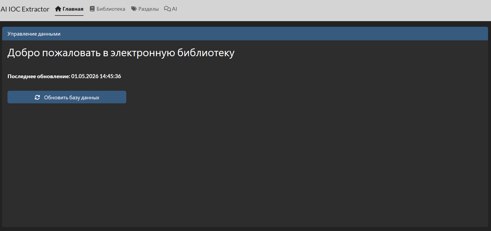
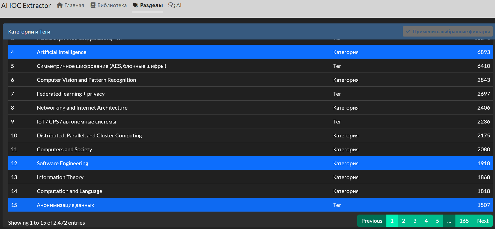
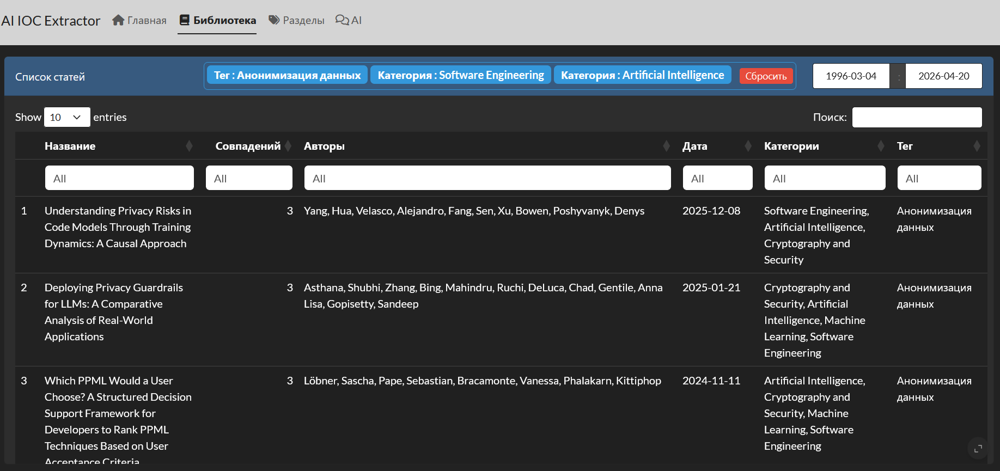
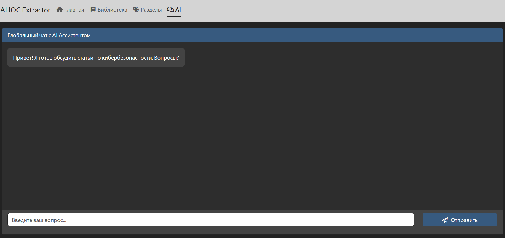
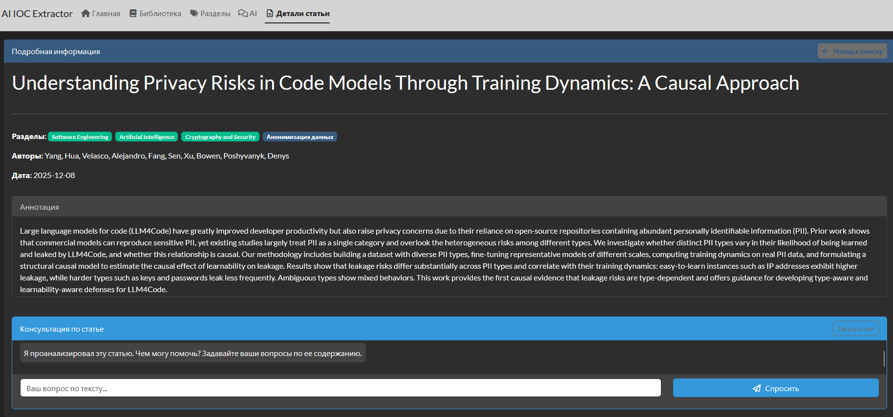

# Тэгирование через ML


## {auto-animate=true auto-animate-easing="ease-in-out"}

::: {data-id="box1" style="background: #000000; width: 10000px; height: 10000px; border-radius: 200px; margin: -5000px 0 0 -5000px;"}
:::

::: {.absolute top=100 left=0 width="10000" height="500"}
**<span style="color: white">Автоматическая разметка датасета через эмбеддинги</span>**
:::

## {auto-animate=true auto-animate-easing="ease-in-out"}


::: {.absolute top=100 left=0 width="10000" height="300"}
Задача — взять 1000 PDF статей по кибербезопасности и автоматически присвоить

каждой теги, не используя LLM и не размечая вручную. Это решение первой и 

самой трудоёмкой проблемы: откуда взять обучающие данные.


:::
## {auto-animate=true auto-animate-easing="ease-in-out"}
::: {.absolute top=100 left=0 width="10000" height="300"}

Подход основан на семантическом сходстве. Текст статьи и названия 

тегов переводятся в векторное пространство с помощью модели 

all-MiniLM-L6-v2, после чего измеряется косинусное расстояние 

между вектором статьи и векторами каждого тега. Три ближайших 

тега по смыслу и становятся метками.
:::

## {auto-animate=true, background-color="black"}

::: {.r-hstack}
::: {.absolute top=100 left=-50 width="10000" height="300"}
Технические решения:

- **PyMuPDF (fitz)** — извлечение текста из PDF

- **sentence-transformers/all-MiniLM-L6-v2** — 

лёгкая быстрая модель для эмбеддингов

- **cosine_similarity** — метрика близости векторов

- **Формат JSONL** — стандарт для файнтюнинга

:::
:::
::: {.r-hstack}
::: {.absolute top=20 left=900 width="850" height="300"}
```{.py}
model = SentenceTransformer("sentence-transformers/"
"all-MiniLM-L6-v2")
tag_emb = model.encode(TAGS, normalize_embeddings=True)
def extract_text(path):
    try:
        doc = fitz.open(path)
        text = ""
        for page in doc:
            text += page.get_text()
        text = re.sub(r"\s+", " ", text).strip()
        if len(text) < MIN_CHARS:
            return None
        return text[:MAX_CHARS]
    except Exception:
        return None
def get_tags(text):
    emb = model.encode([text], normalize_embeddings=True)
    sims = cosine_similarity(emb, tag_emb)[0]
    idx = sims.argsort()[-TOP_K:][::-1]
    return [TAGS[i] for i in idx]
```
:::
:::

## {auto-animate=true, background-color="black"}

::: {.r-hstack}
::: {.absolute top=100 left=-50 width="10000" height="300"}
**Результат** — файл qwen_dataset.jsonl, 

где каждая запись - это готовый диалог 

в формате system/user/assistant, 

пригодный для файнтюнинга.
:::
:::
::: {.r-hstack}
::: {.absolute top=-20 left=900 width="850" height="300"}
```{.py}
pdf_files = [
    f for f in os.listdir(PDF_FOLDER)
    if f.endswith(".pdf")
]
print("PDF FOUND:", len(pdf_files))
written = 0
skipped = 0
with open(OUTPUT_JSONL, "w", encoding="utf-8") as f:
    for file in tqdm(pdf_files):
        path = os.path.join(PDF_FOLDER, file)
        text = extract_text(path)
        if text is None:
            skipped += 1
            continue
        tags = get_tags(text)
        sample = {
            "messages": [
                {
                    "role": "system",
                    "content": SYSTEM_PROMPT
                },
                {
                    "role": "user",
                    "content": text
                },
                {
                    "role": "assistant",
                    "content": "|".join(tags)
                }
            ]
        }
        f.write(json.dumps(sample, ensure_ascii=False) + "\n")
        written += 1
```
:::
:::

## {auto-animate=true auto-animate-easing="ease-in-out"}

::: {data-id="box1" style="background: #000000; width: 10000px; height: 10000px; border-radius: 200px; margin: -5000px 0 0 -5000px;"}
:::

::: {.absolute top=100 left=0 width="10000" height="500"}
**<span style="color: white">Файнтюнинг Qwen3-8B через Unsloth + LoRA</span>**
:::

## {auto-animate=true auto-animate-easing="ease-in-out"}


::: {.absolute top=100 left=0 width="10000" height="300"}
На этом этапе берётся предобученная модель **Qwen3-8B** и дообучается на 

размеченном датасете из 1000 статей. **Цель** — научить модель определять 

теги по тексту статьи в рамках строго заданного словаря из 29 категорий.

:::
## {auto-animate=true auto-animate-easing="ease-in-out"}
::: {.absolute top=100 left=0 width="10000" height="300"}

Для обучения используется **LoRA (Low-Rank Adaptation)** — метод который 

не меняет все веса модели, а добавляет небольшие адаптерные матрицы 

к ключевым слоям. Это позволяет обучать 8-миллиардную модель на 

обычном потребительском GPU вместо кластера.

Фреймворк **Unsloth** оптимизирует обучение под конкретное железо — 

ускоряет forward/backward pass и снижает потребление VRAM примерно

в 2 раза по сравнению с обычным HuggingFace.

:::

## {auto-animate=true, background-color="black"}

::: {.r-hstack}
::: {.absolute top=100 left=-50 width="10000" height="300"}
Ключевые параметры обучения:

- **15 эпох** — датасет маленький (1000 примеров), 

нужно много проходов

- **Cosine learning rate scheduler** — плавное 

снижение LR к концу обучения

- **Gradient checkpointing** — экономия VRAM за
счёт пересчёта активаций


:::
:::
::: {.r-hstack}
::: {.absolute top=20 left=900 width="850" height="300"}
```{.py}
tokenizer = get_chat_template(tokenizer, 
chat_template="qwen-2.5")
dataset = load_dataset("json", data_files=DATASET_PATH,
split="train")
dataset = standardize_sharegpt(dataset)
def formatting_func(examples):
    texts = [
        tokenizer.apply_chat_template(
            convo,
            tokenize              = False,
            add_generation_prompt = False
        )
        for convo in examples["messages"]
    ]
    return {"text": texts}
dataset = dataset.map(formatting_func, batched=True)
trainer = SFTTrainer(...)
trainer.train()
```
:::
:::

## {auto-animate=true auto-animate-easing="ease-in-out"}

::: {data-id="box1" style="background: #000000; width: 10000px; height: 10000px; border-radius: 200px; margin: -5000px 0 0 -5000px;"}
:::

::: {.absolute top=100 left=0 width="10000" height="500"}
**<span style="color: white">Параллельная разметка 47 000 статей: теги и тип исследования(теги контекста)</span>**
:::

## {auto-animate=true auto-animate-easing="ease-in-out"}


::: {.absolute top=100 left=0 width="10000" height="300"}
Дообученная модель через LM Studio API обрабатывает все 47 390 абстрактов

и присваивает каждой статье два типа меток.

**Первый** - тематические теги по двухуровневой иерархии из 9 родительских

категорий и 31 подкатегории. Модель выбирает от 1 до 4 тегов, предпочитая 

конкретные подкатегории общим. Если подкатегория не подходит - ставится 

родительская.

**Второй** - тип исследования, отвечающий на вопрос что именно делает статья:

предлагает атаку, защиту, формальную модель, обзор литературы или что-то иное. 

Это второе измерение классификации позволяет фильтровать базу не только

по теме, но и по характеру вклада.
:::

## {auto-animate=true, background-color="black"}

::: {.r-hstack}
::: {.absolute top=20 left=-50 width="10000" height="300"}
Технические решения:

- **future + furrr** - параллельные сессии R 

для одновременных HTTP запросов

- **Двухуровневая иерархия тегов в промпте** — 

модель видит структуру и выбирает осознанно

- **/no_think** - отключение reasoning mode Qwen3

- **Checkpoint система** - load_existing при старте

подхватывает уже готовые результаты

- **Двойной матчинг** - точное совпадение, 

затем мягкое через grepl

- **Запасные теги** - никогда не возвращает null
:::
:::
::: {.r-hstack}
::: {.absolute top=20 left=900 width="850" height="300"}
```{.r}
lm_request <- function(prompt, max_tokens = 80,
                       url = "http://localhost:1234/v1/chat/"
                       "completions",
                       model = "tokenizer_qwen3-8b.Q6_K",
                       max_retries = 3) {
  payload <- list(
    model       = model,
    messages    = list(list(role = "user", content = prompt)),
    temperature = 0.0,
    max_tokens  = max_tokens
  )
  for (attempt in seq_len(max_retries)) {
    result <- tryCatch({
      resp <- httr::POST(
        url,
        body   = jsonlite::toJSON(payload, auto_unbox = TRUE),
        encode = "raw",
        httr::add_headers("Content-Type" = "application/json"),
        httr::timeout(60)
      )
      trimws(httr::content(resp, "parsed")$choices[[1]]
      $message$content)
    }, error = function(e) {
      Sys.sleep(2)
      NA
    })
    if (!identical(result, NA)) return(result)
  }
  return("")
}
```
:::
:::

## {auto-animate=true, background-color="black"}

::: {.r-hstack}
::: {.absolute top=20 left=-50 width="10000" height="300"}
Для ускорения обработки используется

параллельное выполнение через future + furrr - 

8 воркеров отправляют запросы 

одновременно, соответствуя числу 

параллельных слотов LM Studio.
:::
:::
::: {.r-hstack}
::: {.absolute top=20 left=900 width="850" height="300"}
```{.r}
process_article <- function(article, lm_url, model_name,
 max_retries, tag_tree, all_tags, allowed_context) {
  article_id <- as.character(article$id)
  abstract   <- trimws(if (!is.null(article$abstract))
  article$abstract else "")
  if (nchar(abstract) == 0) {
    return(list(id = article_id, skipped = TRUE))
  }
  raw_tags    <- lm_request(build_tags_prompt(
    abstract, tag_tree),
                            max_tokens = 80, url = lm_url,
                            model = model_name, max_retries
                             = max_retries)
  raw_context <- lm_request(build_type_prompt(abstract),
                            max_tokens = 30, url = lm_url,
                            model = model_name, max_retries
                             = max_retries)

  tags    <- parse_tags(raw_tags, all_tags)
  context <- parse_context_tags(raw_context, allowed_context)
  list(
    id           = article_id,
    tags         = tags,
    context_tags = context,
    abstract     = abstract,
    skipped      = FALSE
  )
}
```
:::
:::

## {auto-animate=true, background-color="black"}

::: {.r-hstack}
::: {.absolute top=20 left=-50 width="10000" height="300"}
Результат сохраняется в JSON каждые 

10 батчей с поддержкой продолжения 
 
 с места остановки.
:::
:::
::: {.r-hstack}
::: {.absolute top=20 left=900 width="850" height="300"}
```{.r}
load_existing <- function(path) {
  if (!file.exists(path)) return(list())
  tryCatch({
    txt <- trimws(paste(readLines(path, warn = FALSE), 
    collapse = "\n"))
    if (nchar(txt) == 0) return(list())
    data <- jsonlite::fromJSON(path, simplifyVector = FALSE)
    setNames(data, sapply(data, function(x) x$id))
  }, error = function(e) list())
}
save_results <- function(results, path) {
  dir.create(dirname(path), recursive = TRUE, 
  showWarnings = FALSE)
  output <- unname(lapply(results, function(x) {
    x$skipped <- NULL
    x
  }))
  write(jsonlite::toJSON(output, auto_unbox = TRUE
  , pretty = TRUE), path)
}
```
:::
:::

# Web-приложение
## {auto-animate=true auto-animate-easing="ease-in-out"}

::: {data-id="box1" style="background: #000000; width: 0px; height: 1px; border-radius: 200px;"}
:::

::: {.absolute top=20 left=0 width="10000" height="300"}
Интерфейс построен на базе пакета **bslib**, который заменяет стандартный дизайн Shiny

на современные компоненты **Bootstrap 5**. Приложение использует многостраничную

навигацию (page_navbar). В отличие от старых подходов Shiny, где страницы
 
перерисовывались сервером (renderUI), здесь все вкладки загружаются в DOM сразу, 

а переключение между ними происходит мгновенно на стороне клиента.

{width="1500" height="700"}
:::

## {auto-animate=true auto-animate-easing="ease-in-out"}

::: {data-id="box1" style="background: #000000; width: 0px; height: 1px; border-radius: 200px;"}
:::

::: {.absolute top=20 left=0 width="10000" height="300"}
Основные вкладки:

- **Главная (home)**: Дашборд для ручного обновления базы данных.

- **Библиотека (articles)**: Основная таблица со списком статей.

- **Разделы (sections)**: Инструмент для сборки комбинаций тегов и категорий.

- **AI (chat)**: Глобальный чат с ИИ-ассистентом.

- **Детали статьи (article_detail)**: Скрытая вкладка, которая динамически 

активируется при клике на конкретную статью в "Библиотеке".

{width="1500" height="700"}
:::

## {auto-animate=true, background-color="black"}

::: {.r-hstack}
::: {.absolute top=100 left=-50 width="10000" height="300"}
Взаимодействие с базой данных вынесено в 

изолированную функцию **fetch_data()**. Для 

подключения используется пакет mongolite. 

Подключение происходит безопасно:

учетные данные не зашиты в код, а 

подтягиваются из переменных окружения. 

Функция использует механизм 

**on.exit(db$disconnect())**, что гарантирует 

автоматическое закрытие соединения с БД

при любом исходе (даже при ошибках), 

предотвращая утечку соединений.
:::
:::
::: {.r-hstack}
::: {.absolute top=200 left=900 width="750" height="300"}
```{.r}
fetch_data <- function() {
  db <- mongolite::mongo(
    collection = "metadata",
    db = "cybersecurity_articles",
    url = sprintf(
      "mongodb://%s:%s@%s:27017/cybersecurity?
      authSource=admin",
      Sys.getenv("MONGO_USER"),
      Sys.getenv("MONGO_PASS"),
      Sys.getenv("MONGO_HOST")
    )
  )
  on.exit(db$disconnect())

  data <- db$find("{}")
  if (nrow(data) > 0) {
    data <- data %>% mutate(date = as.Date(date))
  }
  return(data)
}
```
:::
:::

## {auto-animate=true, background-color="black"}

::: {.r-hstack}
::: {.absolute top=100 left=-50 width="10000" height="300"}
Приложение объединяет Категории и Теги 

в единый справочник "Разделы". Поскольку

**MongoDB** часто отдает списки в смешанном 

формате (где-то пустые NULL, где-то строки), 

перед фильтрацией применяется функция 

**sanitize_list_col**, приводящая массивы 

к единому строковому виду.

Вкладка "Разделы" позволяет выбрать 

несколько элементов (логическое ИЛИ). 

Реактивный блок **filtered_data** вычисляет 

match_score для каждой статьи:
:::
:::
::: {.r-hstack}
::: {.absolute top=100 left=850 width="850" height="300"}
```{.r}
match_scores <- sapply(1:nrow(data), function(i) {
        score <- 0
        cat_list <- if ("categories" %in% names(data) && 
        !is.null(data$categories[[i]])) unlist(data$
        categories[[i]]) 
        else character(0)
        tag_list <- if ("tag" %in% names(data) 
        && !is.null(data$tag[[i]])) unlist(data$tag[[i]])
        else character(0)

        for (j in 1:nrow(filts)) {
          if (filts$type[j] == "Категория" && 
          (filts$value[j] %in% cat_list)) score <- score + 1
          if (filts$type[j] == "Тег" && 
          (filts$value[j] %in% tag_list)) score <- score + 1
        }
        score
      })

      data$match_score <- match_scores
      data <- data %>%
        filter(match_score > 0) %>%
        arrange(desc(match_score), desc(date))
```
:::
:::

## {auto-animate=true, background-color="black"}

::: {.absolute top=100 left=-50 width="10000" height="300"}
Благодаря этому алгоритму в верху списка всегда оказываются статьи, 

наиболее полно удовлетворяющие сложному запросу пользователя.
:::
::: {.r-hstack}
::: {.absolute top=0 left=-170 width="1000" height="700"}
{width="1800" height="1200"}
:::
:::
::: {.r-hstack}
::: {.absolute top=0 left=800 width="1000" height="700"}
{width="1800" height="1200"}
:::
:::

## {auto-animate=true auto-animate-easing="ease-in-out"}

::: {data-id="box1" style="background: #000000; width: 0px; height: 1px; border-radius: 200px;"}
:::

::: {.absolute top=20 left=0 width="10000" height="300"}
Shiny по умолчанию однопоточен. Если бы мы выполняли HTTP-запросы

к ИИ синхронно, весь интерфейс приложения "зависал" бы для всех 

пользователей на время генерации ответа.

Для решения этой проблемы архитектура приложения использует 

связку пакетов future и promises (plan(multisession)). 

Это позволяет делегировать сетевые запросы к ИИ 

в отдельные фоновые процессы.

:::

## {auto-animate=true, background-color="black"}

::: {.r-hstack}
::: {.absolute top=100 left=-50 width="10000" height="300"}
Глобальный чат использует HTTP клиент **httr2**. 

При отправке сообщения создается фоновая

задача(**future**), которая "обещает" (**promise**) 

вернуть ответ. Когда ответ приходит, 

срабатывает оператор %...>%, 

который обновляет UI, не 

прерывая работу основного потока R.

:::
:::
::: {.r-hstack}
::: {.absolute top=0 left=900 width="750" height="300"}
```{.r}
future_promise <- future(
      {
        tryCatch({
            resp <- httr2::request(Sys.getenv(
              "AI_SERVICE_URL")) %>%
              httr2::req_body_json(list(
                message = user_text)) %>%
              httr2::req_timeout(60) %>%
              httr2::req_perform() %>%
              httr2::resp_body_json()
            resp$choices[[1]]$message$content
          },
          error = function(e) {
            paste("Ошибка при обращении к AI-сервису:",
             e$message)
          })
      },
      seed = TRUE
    )
    future_promise %...>% (function(ai_response) {
      global_chat_data$history <- append(
        global_chat_data$history, 
      list(list(role = "ai", text = ai_response)))
      global_chat_data$is_loading <- FALSE
    }) %...!% (function(error) {
      global_chat_data$history <- append(
        global_chat_data$history, 
      list(list(role = "ai", text = "Произошла системная 
      ошибка при обращении к AI.")))
      global_chat_data$is_loading <- FALSE
    })
```
:::
:::

## {auto-animate=true auto-animate-easing="ease-in-out"}

::: {data-id="box1" style="background: #000000; width: 10000px; height: 10000px; border-radius: 200px; margin: -5000px 0 0 -5000px;"}
:::

::: {.absolute top=0 left=0 width="10000" height="500"}
**<span style="color: white">UI чата:</span>**

{width="1400" height="700"}
:::


## {auto-animate=true auto-animate-easing="ease-in-out"}

::: {.absolute top=0 left=0 width="10000" height="500"}
В карточке статьи есть возможность начать диалог по конкретному тексту (аннотации). 

При инициализации чата (SYSTEM_INIT_ANALYSIS) текст статьи скрыто отправляется в 

ИИ-сервис для предварительного анализа. Логика обращения вынесена в 

функцию-посредник ask_article_ai. В текущей версии она содержит симуляцию

задержки, но готова к интеграции с реальным локальным портом.

{width="1400" height="600"}
:::

## {auto-animate=true, background-color="black"}

::: {.r-hstack}
::: {.absolute top=100 left=-50 width="10000" height="300"}
Приложение упаковывается в Docker

с установкой необходимых библиотек 

(например, zlib1g-dev для mongolite 

и libuv1-dev для асинхронности). 

На самом приложение скрыто за

Nginx, который выступает в роли 

Reverse Proxy, обеспечивая 

терминацию SSL (HTTPS) и 

проброс WebSockets, необходимых

для непрерывного коннекта между браузером и 

Shiny сервером.

:::
:::
::: {.r-hstack}
::: {.absolute top=20 left=670 width="500" height="300"}
```{.yaml}
version: '3.8'
services:
  mongodb:
    image: mongo:latest
    container_name: mongodb
    restart: always
    environment:
      MONGO_INITDB_ROOT_USERNAME: …
      MONGO_INITDB_ROOT_PASSWORD: …
    ports:
      - "127.0.0.1:27017:27017"
    volumes:
      - mongo_data:/data/db
  mongo-express:
    image: mongo-express:latest
    container_name: mongo-express
    restart: always
    ports:
      - "127.0.0.1:8081:8081"
```
:::
:::

::: {.r-hstack}
::: {.absolute top=20 left=1200 width="550" height="300"}
```{.yaml}
    environment:
      ME_CONFIG_BASICAUTH_USERNAME: …
      ME_CONFIG_BASICAUTH_PASSWORD: …
      ME_CONFIG_MONGODB_ADMINUSERNAME: …
      ME_CONFIG_MONGODB_ADMINPASSWORD: …
      ME_CONFIG_MONGODB_URL: mongodb://
      ...:...@mongodb:27017/
    depends_on:
      - mongodb
  shiny-ai-ioc:
        container_name: shiny-ai-ioc
        restart: unless-stopped
        ports:
            - 127.0.0.1:3838:3838
        environment:
            - MONGO_USER=…
            - MONGO_PASS=…
            - MONGO_HOST=172.19.0.2
            - AI_SERVICE_URL=
        image: shiny-ai-ioc
volumes:
  mongo_data:
```
:::
:::

# Заключение


## {auto-animate=true auto-animate-easing="ease-in-out"}

::: {data-id="box1" style="background: #000000; width: 0px; height: 1px; border-radius: 200px;"}
:::

::: {.absolute top=100 left=0 width="10000" height="300"}
Таким образом, мы создали прототип нашего приложения.

В дальнейшем нам необходимо совершенствовать наш продукт, 

оптимизировав и дополнив его функционал.
:::

## Ссылки {background-color="white"}

### EG Team

<div style="margin-top: 40px; padding: 20px; background-color: rgba(255, 255, 255, 0.05); border-radius: 8px;">

**GitHub**: https://github.com/Llooleg/AI-IOC-Extractor<br>
**Telegram**: https://t.me/+KLvdo-ZnRCpmNDc6

</div>


# Спасибо за внимание!

Готовы ответить на ваши вопросы.