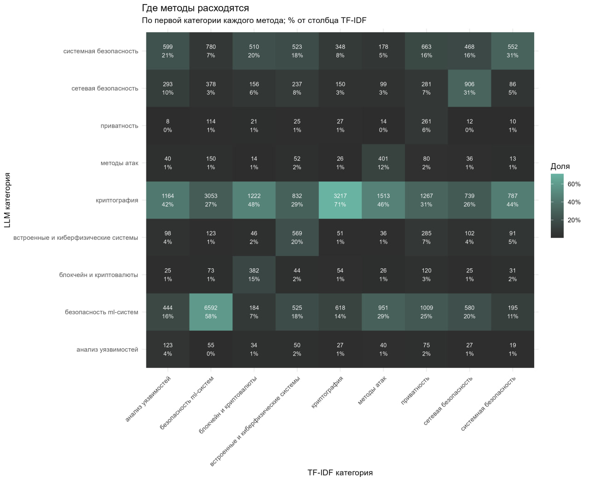
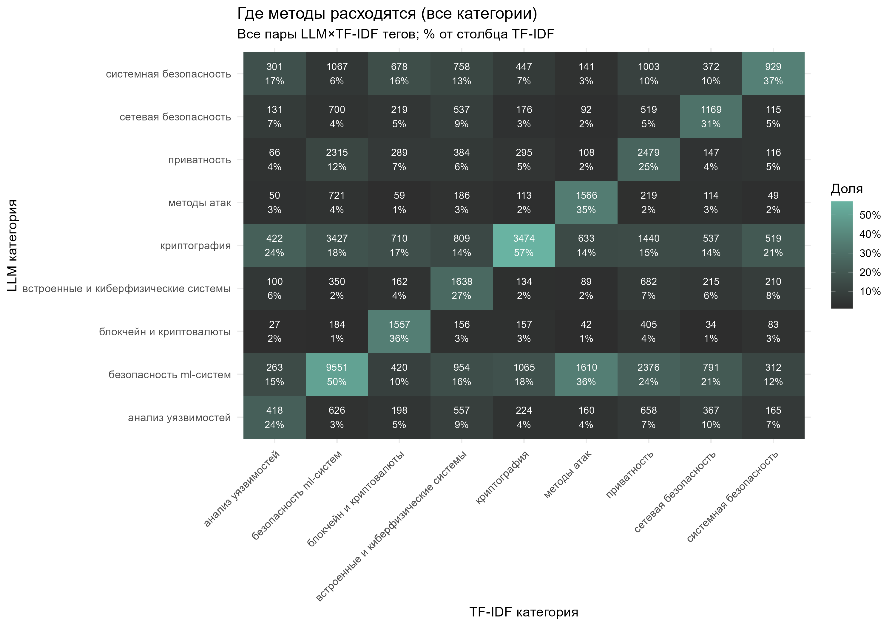
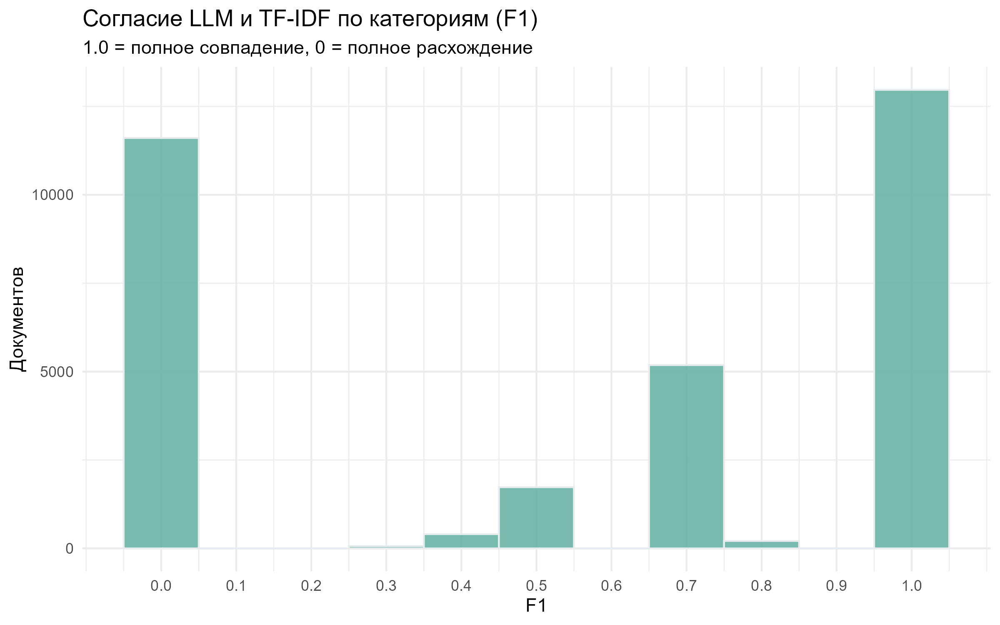
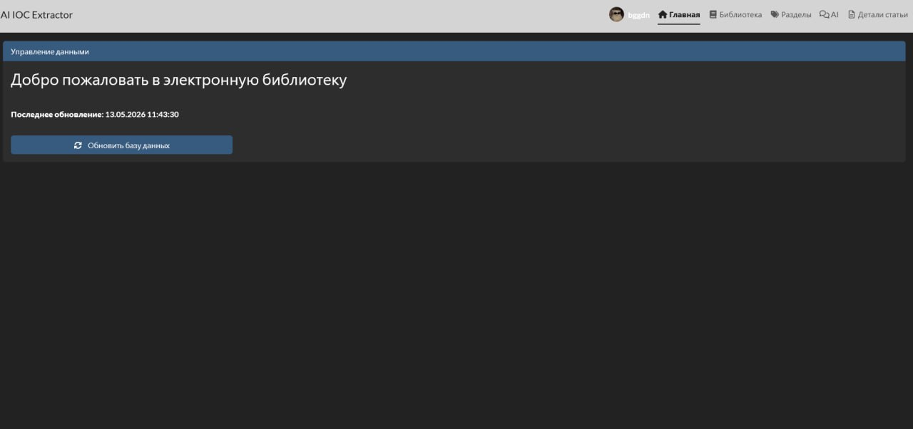
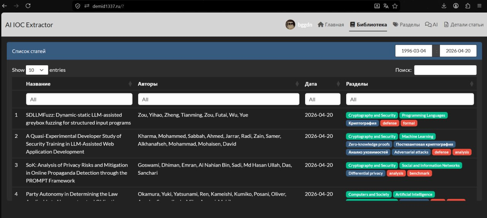
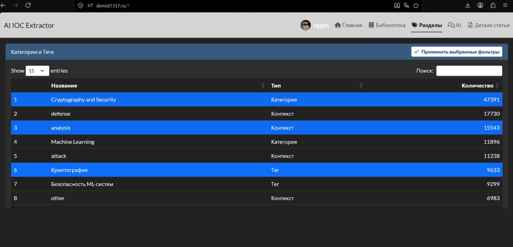
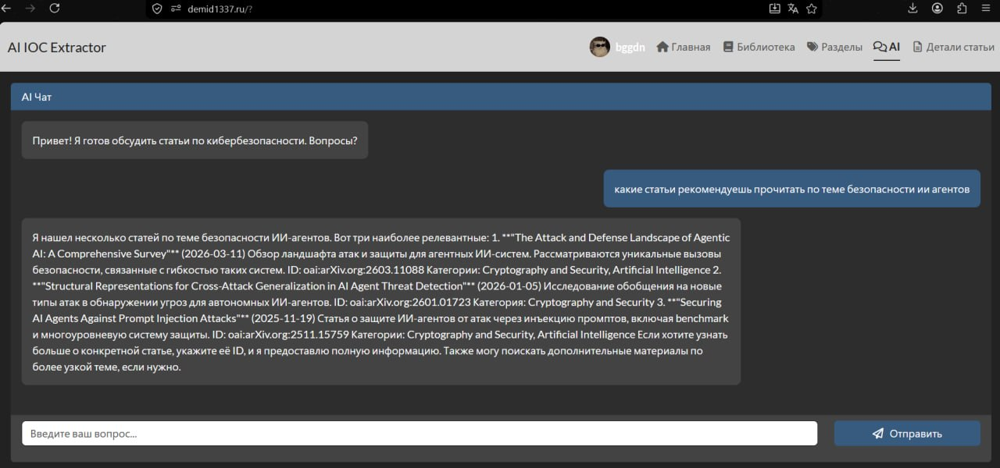
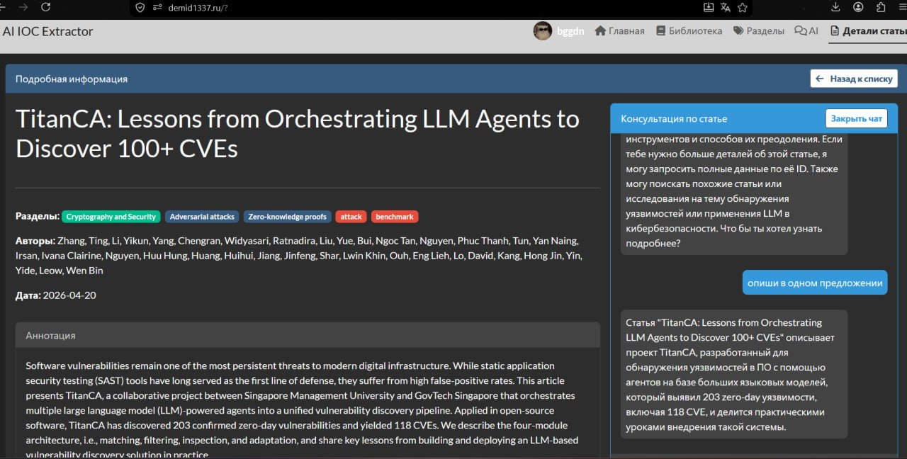

## Задача {background-color="#120207"}

  <h2>Разработать специализированное веб-приложение для работы с контентом по теме информационной безопасности, которое включает:</h2>
  
<b>Структурированную базу данных</b> статей, исследований и аналитических материалов; 

  
<b>Интеллектуальную систему тегирования</b> на основе нейросетевых алгоритмов; 

  
<b>Семантический поиск</b>, понимающий контекст и смысл запросов; 

  
<b>Инструменты аналитики</b> для выявления трендов и связей между угрозами. 

---

## Целевая аудитория {background-color="#120207"}

  <h2>Данный продукт поможет:</h2>
  
<b>Начинающим специалистам в области ИБ:</b> лёгкий поиск нужного материала;

  
<b>ИБ-аналитикам:</b> возможность структурированного вывода статей;

  
<b>Разработчикам ИБ-инструментов:</b> отслеживание новых угроз;

  
<b>ИБ-специалистам любого уровня</b>.

---

## Этапы запуска решения {background-color="#120207"}

  <h2><b>1.</b> ETL процесс;</h2>
  <h2><b>2.</b> Обогащение данных с использованием LLM;</h2>
  <h2><b>3.</b> Загрузка в MongoDB;</h2>
  <h2><b>4.</b> Запуск shiny-приложения и веб-сервера.</h2>

---

## ETL процесс {background-color="#120207"}

:::: {.columns}

::: {.column width="35%"}

Выгрузка данных с arxiv.org

### Какие данные попадают в датасет:

- авторы статьи 
- заголовок 
- дата
- id статьи 
- абстракт
- категории  

:::

::: {.column width="7%"}

:::

::: {.column .report-card .set-card width="50%"}

### transform&load

Сервер отдаёт данные пачками по 1000 записей.

Каждые 2 пачки загружаем в JSON.

Изменяем формат даты.

Форматируем списки.

Приводим иные поля в нужный формат.

Получаем файл metadata.json, 

готовый к дальнейшей обработке.
:::

::::

---

## Обогащение данных

:::: {.columns style="display:flex; gap:18px;"}

::: {.column .quality-item style="flex:0 0 49%;"}

### Автоматическая разметка датасета через эмбеддинги

1000 PDF статей по кибербезопасности получают теги, не используя LLM и не размечая вручную.

:::

::: {.column .quality-item style="flex:0 0 49%;"}

### Файнтюнинг Qwen3-8B через Unsloth + LoRA

На этом этапе берётся предобученная модель **Qwen3-8B** и дообучается на размеченном датасете из 1000 статей.

:::

::::

:::: {.columns style="display:flex; gap:18px; margin-top:18px;"}

::: {.column .quality-item style="flex:0 0 49%;"}

### Разметка ~50K статей

Дообученная модель через LM Studio API обрабатывает абстракты, присваивая каждой статье 2 типа меток.

:::

::: {.column .quality-item style="flex:0 0 49%;"}

### Сохранение

Результат сохраняется в JSON каждые 10 батчей с поддержкой продолжения с места остановки.

:::

::::

---

## Трудности...

Мы заметили, что модель путает категории и теги, что приводит к несколько... неравномерному распределению тегов и категорий в датасете (вероятные причины - криптография - дефолтный тег, низкая температура модели, промпт, который не совсем чётко разделяет категории и теги).

{width="720" fig-align="center"}

---

## И всё же...

:::: {.columns style="display:flex; gap:18px;"}

::: {.column .quality-item style="flex:0 0 100%; text-align: center;"}
Провели нормализацию результатов, а также прогнали TF-IDF по статьям с тегом криптография. Результаты на экране.

:::: {.columns style="display:flex; gap:20px; justify-content: center;"}
::: {.column style="flex: 0 0 35%;"}
{width="100%" fig-align="center"}
:::
::: {.column style="flex: 0 0 35%;"}
{width="100%" fig-align="center"}
:::

::::

:::
::::

---

## Что же можно сделать?

---

## Уровень верификации (Consensus Scoring)

Создадим матрицу доверия.

High Confidence (F1=1): Если оба метода согласны — тег присваивается автоматически. Это твой золотой фонд (40%).

Low Confidence (Any-hit): Если методы разошлись, вводится весовой коэффициент. Например, тег от TF-IDF получает вес 0.7 (как доказанный фактологически), а тег от LLM — 0.3 (как вероятностный).

---

## Семантическая нормализация

Использовать эмбеддинги (например, sentence-transformers), чтобы схлопнуть ту самую «путаницу».

Если TF-IDF выдал «Blockchain», а LLM — «Cryptography», прогони их через косинусное сходство. Если близость > 0.8, ансамбль должен схлопывать их в родительскую категорию или принимать оба как релевантные.

---

## Перспективы?

Взять те 40 процентов документов, где есть полное совпадение (F1=1).
Использовать их как датасет для дистилляции или дообучения ещё более мелкой и быстрой модели (например, BERT или FastText).
В итоге сделаем систему, которая работает быстрее локальной LLM, точнее TF-IDF и не требует видеокарты размером с системный блок.

---

## Загрузка в MongoDB {background-color="#120207"}

  <h3><b>1.</b> Готовый датасет с новыми тегами загружается в монгоДБ.</h3>
  {width="600" height="450" fig-align="center"}

---

## Запуск shiny и веб-сервера

:::: {.columns style="display:flex; gap:18px;"}

::: {.column .quality-item style="flex:0 0 30%;"}

Интерфейс построен на базе пакета **bslib**, который заменяет стандартный дизайн Shiny на современные компоненты **Bootstrap 5**. Приложение использует многостраничную навигацию (page_navbar).

:::

{width="1000" height="400" fig-align="center"}

::::

---

## Запуск shiny и веб-сервера

:::: {.columns style="display:flex; gap:18px;"}

::: {.column .quality-item style="flex:0 0 35%;"}

Основные вкладки:

- **Главная (home)**: Дашборд для ручного обновления базы данных.

- **Библиотека (articles)**: Основная таблица со списком статей.

- **Разделы (sections)**: Инструмент для сборки комбинаций тегов и категорий.

- **AI (chat)**: Глобальный чат с ИИ-ассистентом.

- **Детали статьи (article_detail)**: Вкладка, которая активируется при клике на статью.

:::

{width="1000" height="400" fig-align="center"}

::::

---

## Запуск shiny и веб-сервера

:::: {.columns style="display:flex; gap:18px;"}

::: {.column .quality-item style="flex:0 0 38%;"}

Приложение объединяет Категории и Теги в единый справочник "Разделы".

Вкладка "Разделы" позволяет выбрать несколько элементов (логическое ИЛИ). 

Благодаря вычислению *match_score* в верху списка всегда оказываются статьи, наиболее полно удовлетворяющие запросу пользователя.

:::

{width="1000" height="400" fig-align="center"}

::::

---

## Запуск shiny и веб-сервера

:::: {.columns style="display:flex; gap:18px;"}

::: {.column .quality-item style="flex:0 0 38%;"}

Также в рамках веб-приложения реализован ИИ-ассистент, который поможет пользователю соориентироваться среди множества статей, подобрав самые подходящие.

Окно с ассистентом также доступно в рамках конкретной статьи, что позволяет получить информацию касательно определённого материала.

:::

{width="600" height="270" fig-align="center"}
{width="600" height="270" fig-align="center"}

::::

---

## Спасибо за внимание! {.center}